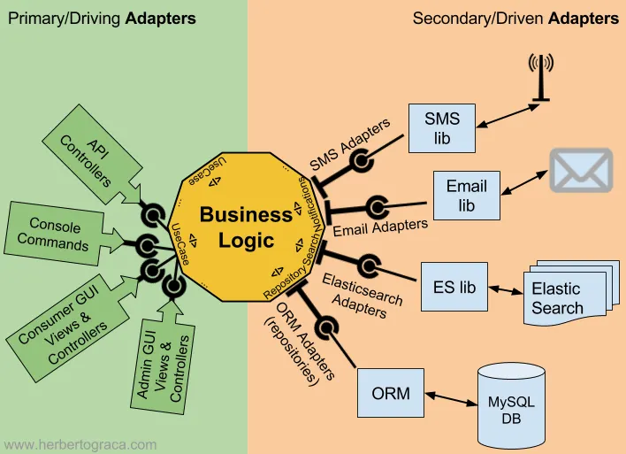

### What is Port and Adapters Architecture?

- On the left side, the adapter depends on the port and gets injected a concrete implementation of the port, which contains the use case. On this side, both the port and its concrete implementation (the use case) belong inside the application;

- On the right side, the adapter is the concrete implementation of the port and is injected in our business logic although our business logic only knows about the interface. On this side, the port belongs inside the application, but its concrete implementation belongs outside and it wraps around some external tool.



[Image's credits](https://medium.com/the-software-architecture-chronicles/ports-adapters-architecture-d19f2d476eca)
### WireMock
`instalation`: [click here](https://wiremock.org/docs/download-and-installation/)

```commandline
    java -jar wiremock-standalone-4.0.0-beta.14.jar --port 8082
```
We will mock our address API.

After running, it will create two folders `mapping` and `__files`. 
So, You will need to add mocking files (/src/main/resources/mock) into `mapping` folder. 


### Kafka

- Topics:
  - tp-cpf-validation
  - tp-cpf-validated
- Publish event `tp-cpf-validated`:
  - JSON format:
    - ```json
        {
          "id": "customer's id",
          "name": "Customer's name",
          "zipCode": "0000000",
          "cpf": "00000000000",
          "isValidCpf": true
        }
        ```


### Security between application layers

- [ArchUnit](https://www.archunit.org/userguide/html/000_Index.html)
- [Test Results - java_in_hexagonal.html](Test%20Results%20-%20java_in_hexagonal.html)